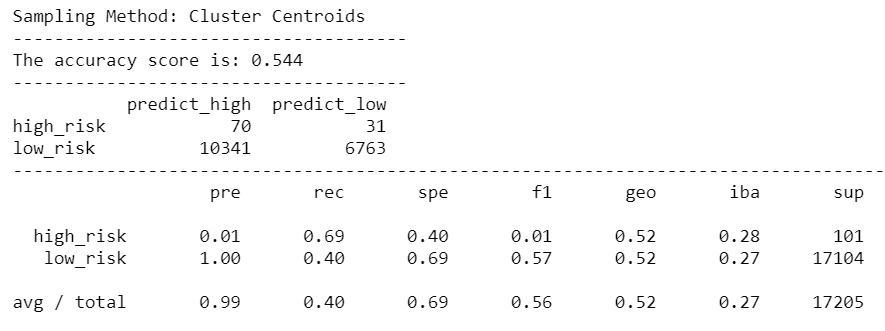

# Credit Risk Analysis

## Overview of Project:
Credit risk is an inherently unbalanced classification problem, as good loans easily outnumber risky loans. Therefore, you’ll need to employ different techniques to train and evaluate models with unbalanced classes

### Purpose:
Use `imbalanced-learn` and `scikit-learn` libraries to build and evaluate models predicting credit risk using resampling. Followings are the type of resampling we use on the credit card credit dataset from LendingClub:
- oversample the data using the `RandomOverSampler` and `SMOTE` algorithms.
- undersample the data using the `ClusterCentroids` algorithm. 
- combinatorial approach of over- and undersampling using the `SMOTEENN` algorithm. 
- compare two new machine learning models that reduce bias, `BalancedRandomForestClassifier` and `EasyEnsembleClassifier`.

Lastly, we review the performance of each model and evaluate which approach is suited for predicting the credit risk of the given dataset.

### Resources:
- Dataset: 'LoanStats_2019Q1.csv'
- Program: Jupyter Notebook

## Results:
#### Naive Random Oversampling:
+ The below VBA code is built to output Ticker, Totaly Daily Volume, and Return of each stock. Also, the code compiles functions to format the output code and report its execution time; 

   

#### SMOTE oversampling:
+ Enter the worksheet's title and headers for tables. Note that `Worksheets("All Stocks Analysis").Activate` code is there to ensure the table is created on the worksheet "All Stocks Analysis" that we want to report.

   

#### Cluster Centroids undersampling:
+ Initialize array of all 12 tickers.
   
   
   
#### SMOTEENN Combination(over and under) sampling:
+ Create and initialize the variables `tickerIndex`  and output arrays `tickerVolume, tickerStartingPrices,` and `tickerEndingPrices` to organize the upcoming code.
   
   
   
#### Balanced Random Forest Classifier:
+ Write `for` loop and `If Then` codes to determine `tickerVolume, tickerStartingPrices,` and `tickerEndingPrices`. 

   
   
   
#### Easy Ensemble AdaBoost Classifier:
+ Write the formula to output Ticker, Total Daily Volume, and Return to the table.
   
   
   

## Summary:
